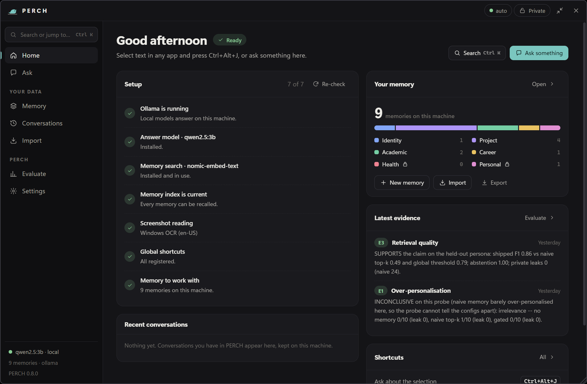
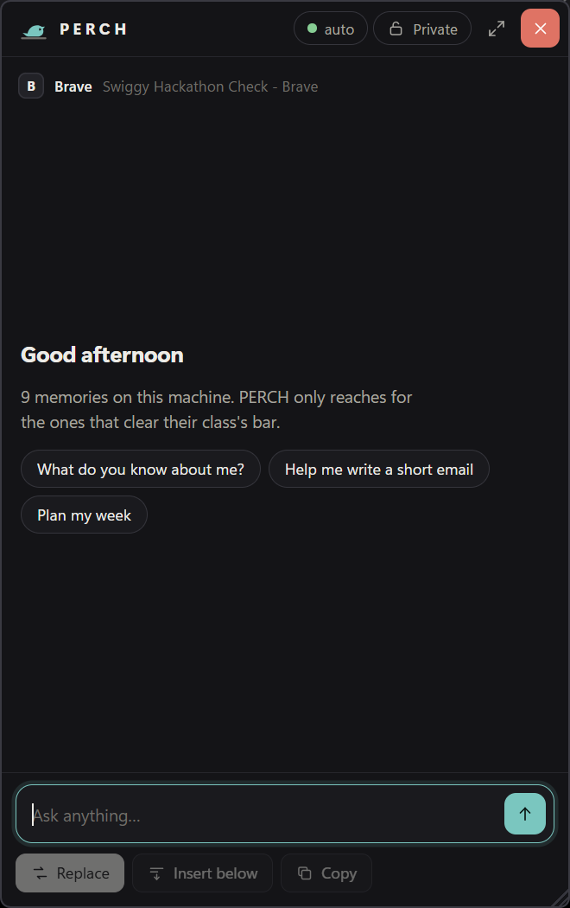
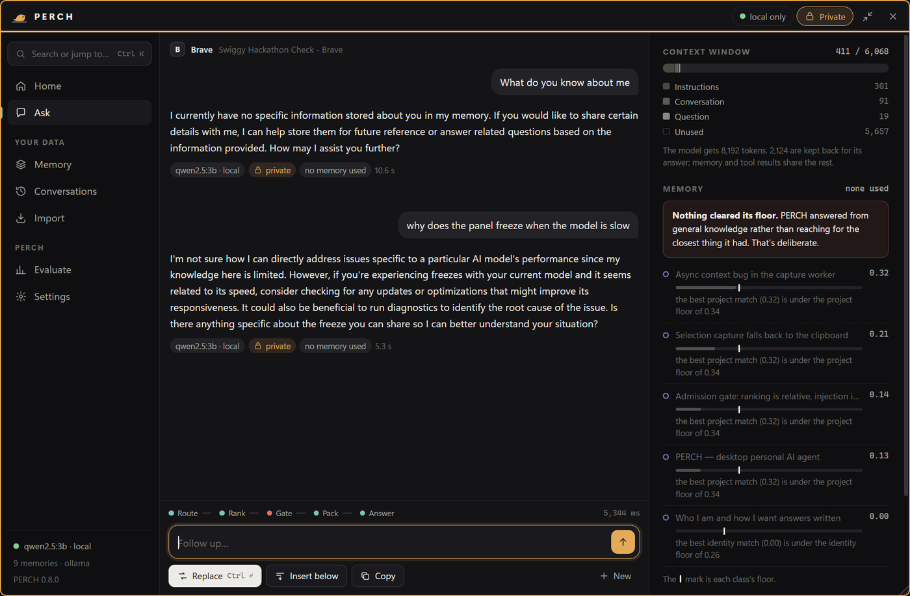
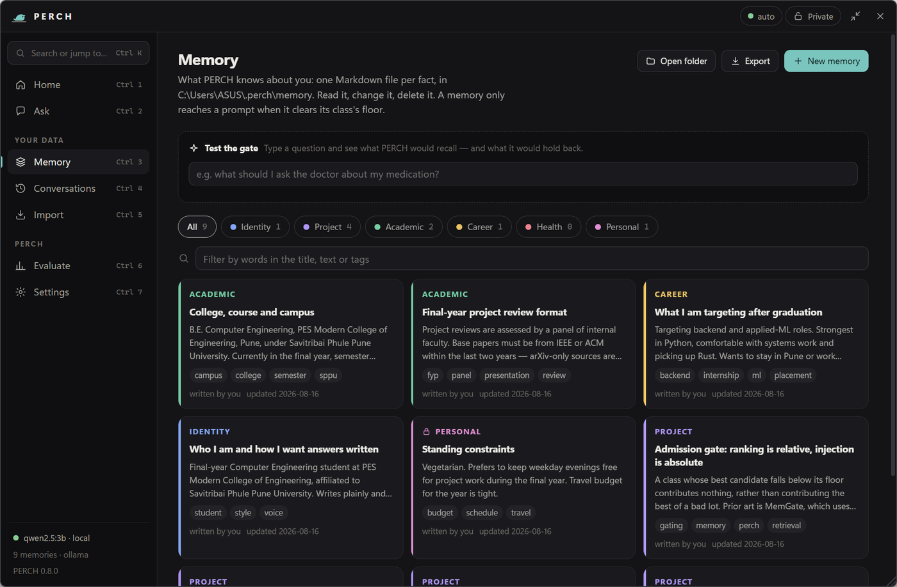
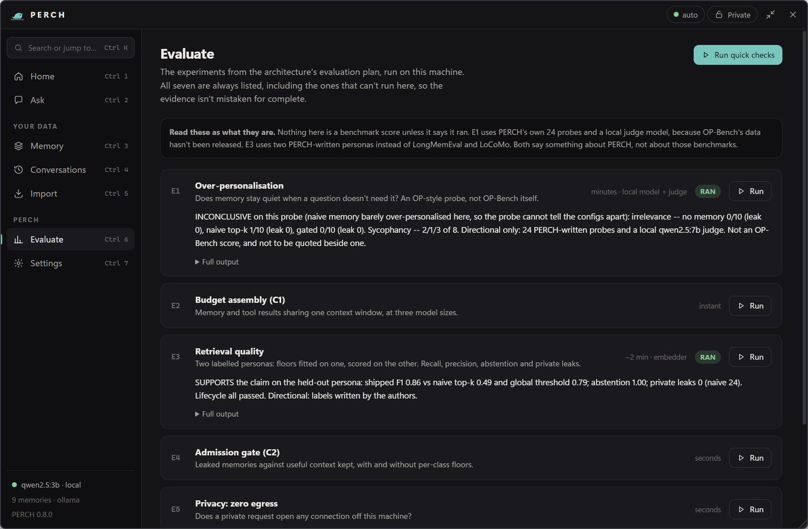

# PERCH

**A personal AI agent that lives where your desktop lives.**

Dormant in the background. Summoned by a selection, a screenshot or a shortcut, anywhere in Windows.
It answers in a slim panel beside your work, it edits in place in the application you were already in,
and it knows who you are — because the memory is **yours**, not a vendor's: plain Markdown files on
your own disk, six typed classes, and a gate that explains every admission and every refusal.

[](tests/test_pipeline.py)
[](docs/DEPLOYMENT.md)
[](requirements.txt)
[](#)

**At a glance**

- 🧠 **Six typed memory classes** (identity, project, academic, career, health, personal), each with its own privacy default and admission floor — not one flat vector store
- 🚪 **A declarative admission gate**: *ranking is relative, injection is absolute.* A class whose best match doesn't clear its floor contributes nothing, and PERCH says so rather than guessing
- 🔒 **Private by class, not by promise.** A Health or Personal memory forces the request to run on a local model, enforced in code, checked by an evaluation (E5)
- 🪟 **Lives in the OS**, not a browser tab — a selection, a screenshot, or a shortcut summons it beside whatever you're doing, anywhere in Windows
- 📊 **Evaluates its own claims** — seven experiments, runnable from the app, that say plainly when something didn't run rather than leaving a gap the reader fills in optimistically
- 📁 **Memory is files you own** — Markdown with YAML frontmatter, one fact per file, in a folder you can read, edit, `git init`, or delete

<p align="center">
  
</p>

---

## Screenshots

<table>
<tr>
<td width="38%" valign="top">

<br><sub><b>Summoned beside your work.</b> A shortcut opens a slim panel next to whatever app you're in.</sub>
</td>
<td width="62%" valign="top">

<br><sub><b>Every answer explains itself.</b> The right rail shows what was retrieved, what cleared its class's floor, what didn't, and why — live, not mocked.</sub>
</td>
</tr>
<tr>
<td valign="top">

<br><sub><b>Memory you can read.</b> One Markdown file per fact, organised by class, editable in place.</sub>
</td>
<td valign="top">

<br><sub><b>Evidence, not marketing.</b> Seven evaluations run from the app itself; each says plainly whether it ran and what it found.</sub>
</td>
</tr>
</table>

---

## Documents

| | |
|---|---|
| [PERCH_ARCHITECTURE.md](docs/PERCH_ARCHITECTURE.md) | the system: memory classes, the retrieval gate, tools, the full pipeline, and a self-critique |
| [PERCH_OS_PRIMER.md](docs/PERCH_OS_PRIMER.md) | how the OS layer works, from first principles, and how OS + app + AI wire together |
| [PERCH_REFERENCES.md](docs/PERCH_REFERENCES.md) | every paper and claim, with links, verification marks, and the objection map |
| [PERCH_Project_Review.pptx](docs/PERCH_Project_Review.pptx) | the review deck, generated by `docs/build_deck.py` |
| [DEPLOYMENT.md](docs/DEPLOYMENT.md) | running it, the portable build, the installer, CI releases, configuration, troubleshooting |

---

## Run it

```bash
pip install -r requirements.txt
python -m app seed
python -m app          # tray icon + shortcuts; the panel appears when summoned
python -m app open     # ... and open the full view straight away
```

Double-click `run_perch.pyw` to start it with no console window (logs go to `~/.perch/logs/perch.log`),
or turn on **Settings → Start when I sign in**. Only one PERCH runs at a time; a second launch says so.

| Shortcut | |
|---|---|
| `Ctrl+Alt+J` | read the current selection, open the panel beside that window |
| `Ctrl+Alt+K` | freeze the screen, drag a region, then ask about it (read on-device by Windows OCR) |
| `Ctrl+Alt+G` | ask with nothing selected |
| `Esc` | dismiss the panel |

**The panel is a WebView2 window** (pywebview over the Edge runtime every Windows 11 machine has), with
the Python core unchanged underneath. It opens compact beside your work; the expand button turns it into
the full app:

| View | |
|---|---|
| **Home** | is this machine ready — a setup checklist that fixes itself (download a missing model, rebuild the index), your memory at a glance, recent conversations, the latest evaluation verdicts |
| **Ask** | the conversation, a live stage rail, and *Why this answer* — every memory used or held back, with its score against its class floor, and how the context window was spent |
| **Conversations** | past exchanges, searchable, resumable. Never retrieved into prompts; private ones are not kept unless you say so |
| **Memory** | every item, by class, editable in place — plus *Test the gate*: type a question, see what would be recalled and what would be held back, without asking a model |
| **Import** | pick an export, name the class, review each proposal (`K` keep, `S` skip), then save |
| **Evaluate** | the seven experiments, runnable from the app |
| **Settings** | route, models, privacy rules, conversation keeping, startup, data folders |

**Ctrl+K** opens a command palette that searches memories and conversations and runs any action;
**?** lists every shortcut. Any answer can be **saved to memory** — PERCH suggests a class, you edit
and save (nothing is ever stored from chat on its own). **Export** puts every memory file in one zip.

**To install it like any other app** — a Start-menu entry, an uninstaller, start-at-sign-in, no admin
rights — build the installer with `packaging\build.ps1`, or tag a release and let GitHub build it. See
[DEPLOYMENT.md](docs/DEPLOYMENT.md).

The window border turns amber in private mode. **Drag the header to move it, the bottom-right corner
to resize.** Where you put it is remembered (Settings can make it always dock beside the host instead).

**If a shortcut does nothing, something else owns it.** Windows does not report this — a failed
registration just lets the keystroke fall through to whatever has focus. Probe your machine:

```bash
python -m app hotkeys
```

It prints which combos are free and gives you the exact `set PERCH_HOTKEY_...` lines to use. PERCH
also tries fallbacks automatically and prints on startup which combo each trigger *actually* got, so
the running app never lies about its own shortcuts.

`Ctrl+Shift+<letter>` is avoided by default because browsers and IDEs reserve most of it —
`Ctrl+Shift+C` is Inspect Element in every Chromium browser. Preinstalled vendor utilities and IMEs
claim a surprising number of `Ctrl+Alt` chords too, which is why the probe exists rather than a
hardcoded "safe" set.

**No model is required to see the whole system work.** With nothing installed, routing, ranking,
admission, packing and the OS layer all run and print their decisions; only generation is stubbed.
For real answers: `ollama run qwen2.5:3b`, or set `PERCH_API_BASE` and `PERCH_API_KEY`.

### Everything else

```bash
python -m app ask [--route local|cloud|auto] [--private] "why does the panel freeze?"
python -m app ablate            # the admission ablation -- start here
python -m app memory            # what is stored, by class
python -m app models            # which routes this machine can reach
python -m app dedupe            # find duplicate memory (--apply to merge)
python -m app eval              # the Part X experiments that can run here
python -m app prompts           # write the six extraction prompts
python -m app import <export> <class>   # ChatGPT / Claude / Gemini -> reviewed memory
python -m pytest tests -q
```

---

## ★ Start with the ablation

`python -m app ablate` runs three configurations of the same retrieval stack over the seeded memory.
The seed contains **no health memory at all** — the only item mentioning *medical* is an academic one
about the campus sharing a road with the group's medical college.

Ask it a medical question and watch what each configuration does:

```
                leaked items     useful context kept
  A naive                8            2 / 3
  B global tau           0            1 / 3
  C ours                 0            3 / 3
```

✅ **Measured, not claimed** — `nomic-embed-text` over the deduplicated seed, 10 Sept 2026, with the
floors fitted by E3 (below) and the rewrite asked about a selection, as the panel always asks it.

## ★ Then the retrieval benchmark — `python -m app eval e3`

Five questions prove the mechanism; they cannot measure it. E3 uses two fictional people: floors are
**fitted** on one (68 memories, 112 labelled questions) and **scored** on the other (42 memories, 69
questions), which is never used for fitting:

```
held-out persona          recall   precision    F1   abstains   private leaks
  A naive top-4             0.95      0.33     0.49     0.00          24
  B one global threshold    0.73      0.86     0.79     0.92           0
  C PERCH                   0.84      0.88     0.86     1.00           0
```

Its first run had shipped PERCH **losing** to the global threshold; the five retrieval defects it found,
and the one "fix" it rejected, are in architecture §10.1. Labels are ours — directional, not a
published benchmark. It also checks the memory lifecycle end to end: write, recall, merge a
near-duplicate, edit, rebuild from files, forget.

> **This table needs a real embedder, and the command refuses to print one without it.** On the
> hashed fallback the ablation *inverts*: config C abstains on every query and scores 0/3, because a
> bag of words cannot relate *"rewrite this formally"* to a note about your writing style. That is a
> property of the embedder, not of the gate (architecture §11.6), so rather than print a number that
> means nothing, `python -m app ablate` prints the per-query traces — routing and the gate's
> reasoning, which do not depend on embedding quality — and tells you what to start. To score it:
>
> ```bash
> ollama serve && ollama pull nomic-embed-text && python -m app rebuild && python -m app ablate
> ```

**A** is what most memory systems do — global top-k, no gate. It answers a question about your
medication with your college details. **B** adds one global threshold; it stops the leak but throws
identity away, so *"rewrite this more formally"* no longer sounds like you. **C** uses permissive class
routing with **per-class floors**, so health stays out and identity gets in.

> **Ranking is relative. Injection must be absolute.** A class whose best candidate falls below its
> floor contributes *nothing* — not the best of a bad lot — and when no class clears, PERCH says it has
> nothing stored rather than inventing relevance.

**Prior art, cited rather than hidden:** MemGate (arXiv 2606.06054) does this with a *learned* gate and
reports cross-domain leakage falling 27.0% → 3.5%. OP-Bench (arXiv 2601.13722) measures the damage when
nobody does it: memory-augmented systems score **26–61% worse than having no memory at all**. Ours is
declarative rather than learned — **every drop prints its own reason**, which a learned gate cannot do.

---

## Bringing your existing history in

Your subscription's **export button** is the only ToS-legitimate bridge out of a vendor's memory of
you. PERCH parses those archives locally, extracts typed memory, and asks before storing any of it.

```bash
python -m app import conversations.json project --dry-run   # see what it would propose
python -m app import conversations.json project             # propose, review, store
```

**One class per run, and you name it.** That is not a limitation to route around — the class is
assigned by *you* at the source, which is exactly what makes the per-class floors above mean something
later. A model guessing the class would put the type system back into the thing it was meant to replace.

**Nothing is stored until you type `y`.** Each proposal is shown in full — body, tags, source session,
extractor confidence, and any warnings — then `y` keeps it, Enter rejects it, `e` retitles it, `a`
accepts all remaining, `q` ends the review. Accepted items are written in one pass at the end, so an
interrupted review never leaves memory half-updated. Re-importing a fact you already have **merges**
into the existing item rather than adding a rival copy, and the summary says which happened.

**Extraction is the one part that cannot be stubbed** — reading a transcript and deciding what is worth
keeping *is* the work. With no model reachable it refuses and says so, rather than reporting that your
history contained nothing.

---

## What is here

```
app/
  os_layer/   winapi · hotkey · capture · inject · ocr            Win32 + WinRT OCR, no privileges
  memory/     classes · schema · store · embed · sessions         6 classes, Markdown + SQLite
  core/       router · ranker · admission · packer · privacy · pipeline
  models/     registry · client                                   local first, always
  tools/      web · files · docs · python · memory · ocr          the agent surface
  ingest/     exports · extract · review · prompts               ChatGPT / Claude / Gemini
  eval/       harness · E1 probe · E2 budget · E3 retrieval · E4 gate · E5 privacy · E6 latency
  ui/         shell · bridge · web/                               the app: window, tray, API, HTML UI
  settings    what the Settings screen changes, as plain JSON
tests/        149 tests, no model or network required
docs/         architecture · OS primer · references · deck
```

## What this is not

- **Not the shipping client yet.** Python throughout, with a WebView2 window. The UI is plain
  HTML/CSS/JS talking to the core through one API object, so a Tauri v2 + Rust shell can take it over
  unchanged, with this Python as the sidecar. To work on the UI in a browser with a fake backend:
  `python -m http.server 5178 --directory app/ui/web`, then open `index.html?mock`.
- **Not the final retrieval model.** The embedding fallback is a hashed bag of words so the pipeline
  runs anywhere; every real measurement uses Ollama or an API embedder.
- **Not doing anything privileged.** No driver, no kernel hook, no OS modification, no special
  permission — the same API surface screen readers have used for twenty years.
